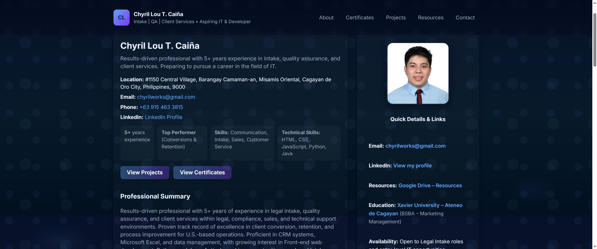

# 🌐 Chyril Lou T. Caiña — Personal Portfolio Website  

A modern, responsive single-page portfolio built with **HTML, CSS, and JavaScript**.  
This project serves as my personal web portfolio to showcase my **professional experience, certificates, and projects**, as well as to provide contact and resource links.  

[](https://steadylearner123.github.io/portfolio-website/)

---

## 🚀 Live Demo  
🔗 **[View Live Site](https://steadylearner123.github.io/portfolio-website/)**  
🔗 **[View Repository](https://github.com/steadylearner123/portfolio-website)**  

---

## 🧩 Features  

✅ **Responsive design** — Optimized layout for mobile, tablet, and desktop  
✅ **Accessibility-ready** — Uses semantic HTML and ARIA labels  
✅ **Modular structure** — HTML, CSS, and JS separated for easier editing  
✅ **Professional sections:**  
- About & Summary  
- Certificates  
- Projects  
- Resources  
- Contact Form (Formspree integration)  

---

## 🏗️ Tech Stack  

| Category | Technology |
|-----------|-------------|
| **Frontend** | HTML5, CSS3, JavaScript |
| **Styling** | Custom CSS (no frameworks used) |
| **Fonts** | Google Fonts – *Inter* |
| **Hosting** | GitHub Pages |
| **Form Handling** | Formspree.io (Free Tier) |

---

## 📂 Project Structure  

portfolio-website/

│

├── index.html # Main HTML page

├── portfolio.css # Styling file

├── script.js # JavaScript for interactivity

├── profile.png # Profile photo

├── preview.png # (Optional) Screenshot preview

└── README.md # Project documentation


---

## 🧠 About the Project  

This portfolio was created to present my background as a **Legal Intake Specialist** transitioning into **IT and Development**. It demonstrates my ability to build and organize web pages, manage clean layouts, and maintain accessible, mobile-friendly design.

Sections include:
- **Professional Summary** with experience and achievements  
- **Certificates** from Google, Cisco, and EF SET  
- **Projects** such as my *Customer Churn Capstone*  
- **Learning Resources** with curated study platforms  
- **Contact Form** for direct communication  

---

## 💼 Key Links  

- 📧 **Email:** [chyrilworks@gmail.com](mailto:chyrilworks@gmail.com)  
- 🔗 **LinkedIn:** [linkedin.com/in/chyrilcaina123456](https://www.linkedin.com/in/chyrilcaina123456/)  
- 🧰 **GitHub:** [github.com/steadylearner123](https://github.com/steadylearner123)  
- 📁 **Google Drive – Certificates & Resources:** [View Folder](https://drive.google.com/drive/folders/1shs02pthReQfEJKR7hu0M79RgonKYWwm?usp=sharing)

---

## ⚙️ How to Run Locally  

1. **Clone this repository:**
   ```bash
   git clone https://github.com/steadylearner123/portfolio-website.git
